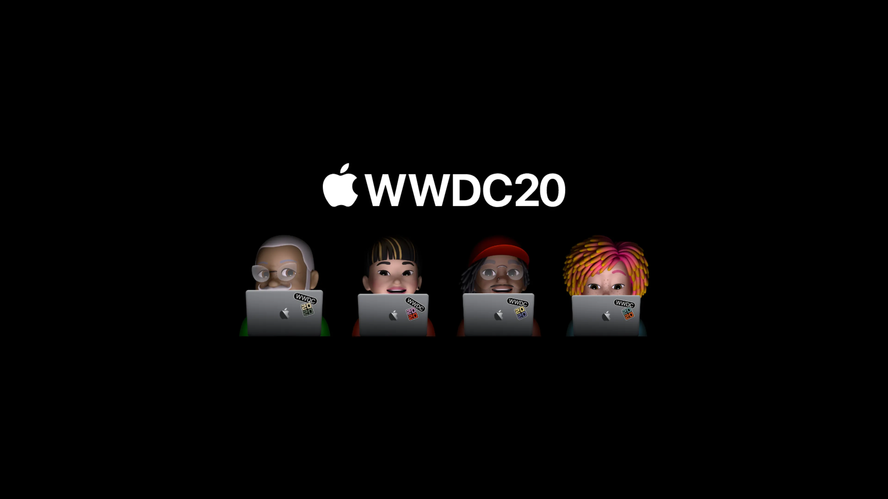
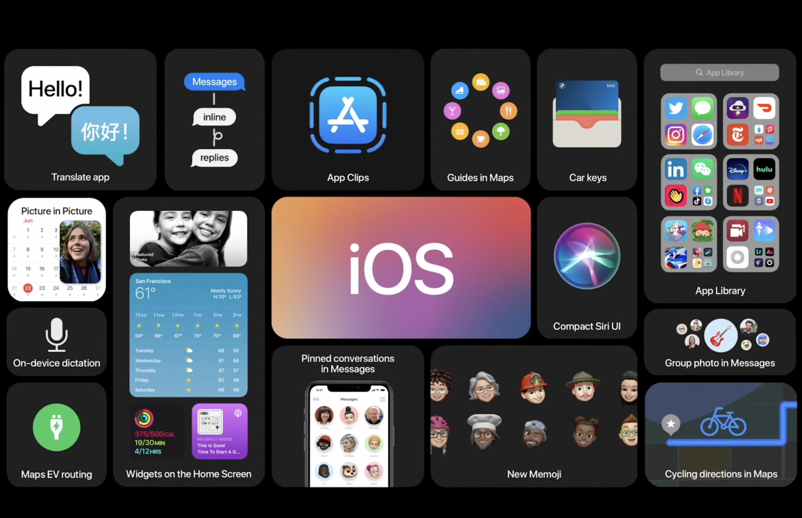
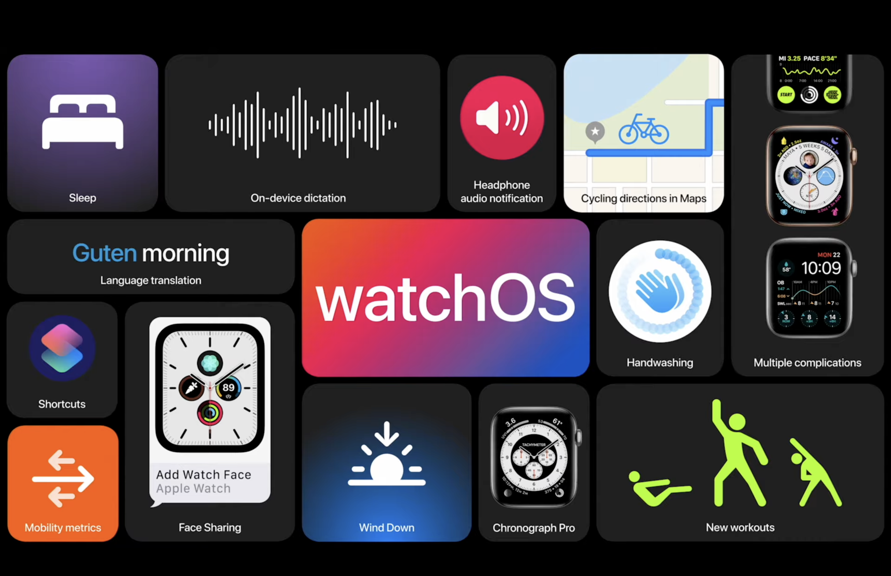
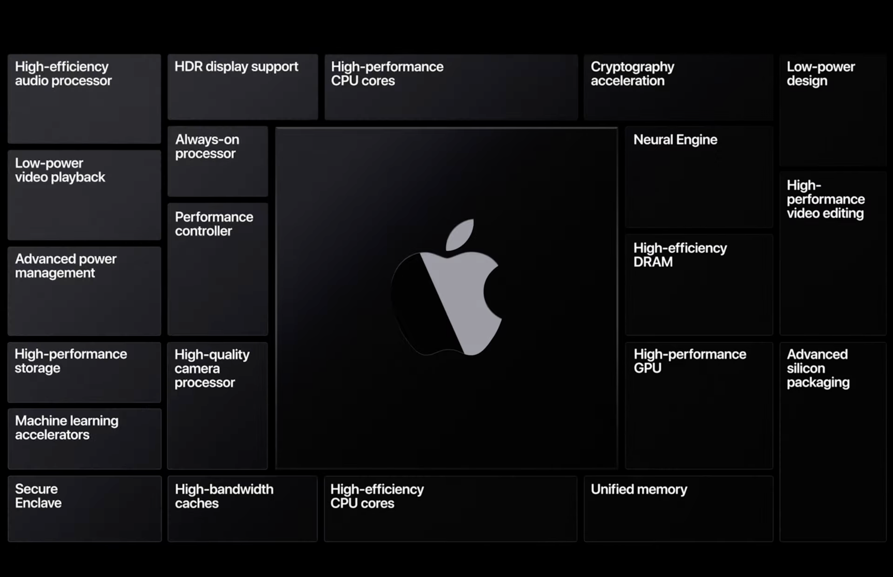

## iOS 14

In fact, quite nice and important improvements in the iOS part of this year’s WWDC event. Widgets and App Clips are just two of the most useful features.

The iOS Highlights:

- _Calls_ will no longer cover the screen, but will be displayed as a small notification at the top of the screen. It also applied to _Siri_.
- With the _App Library_, you will be able to categorize your own applications.
- The _Maps_ became more interactive and easier to use with the guides added to the maps. In addition, special routes can be created for _Electric Vehicle owners_.
- Bicycle use has increased slightly due to the virus. Already in the world and in America, bicycles are becoming more and more popular. Apple made a move to facilitate the travel of the drivers and added _Cycle Directions_ and warnings (stairs, slope, etc.) to its maps. These cycling directions are starting with New York City, LA, the San Francisco Bay Area, plus an unspecified number of cities in China including Shanghai and Beijing.
- With the Picture in _Picture feature_, you can now watch the content played in a small window while doing any work.
- iOS 14 now has a Translate app. Thus, you will not need to download translate applications anymore.
- With Car keys, you can now open your car with your own iPhone. If your keys goes missing, you can turn off your keys remotely via iCloud.
- With App Clips, you can quickly get what you need right when you need it. App Clip is a small part of an app. Being lightweight and easily discoverable causes App Clip to be fast. You can also open the application with a single tap via the pop up, and you can also pay with a single tap.

This new version may will make many iPhone users happy.

## iPad OS 14

In fact, we can say that Apple is reviving the tablet world with this update.

The iPadOS Highlights:

- With the new sidebar, exploring Photos just got easier. You can move the photo you want to drag to anywhere you want by holding it down.
- As with iOS, Calls will no longer cover the entire screen, compact notification that can be tapped or flicked away to dismiss all while not disturbing what you were looking at or working on. Incidentally, this new feature works on calls in third-party apps as well.
- Search Bar, redesigned with compact design you can now search over any application. You can also quickly go where you want to go by typing just a few characters.
- Speaking of the larger screen, the Music app gets a redesign as well with a full-screen player mode complete with rolling lyrics.
- One of the biggest rebuilt is with Apple Pencil, which, though slick, has always felt under utilised on the iPad. Now, using a function called Scribble, iPadOS can convert handwriting to text in any field. You can double-tap to select specific pieces of handwriting and edit to the extent where the iPad seemingly treats handwriting the same as typed text. Just scribble to delete the text. You can also call any number directly.
- The Search function gets an overhaul, too, as Apple has made now made it a Universal Search where it can treat as an app launcher, contact finder, web searcher as well as find references with documents themselves.
- If you had an important message, you can pin your important message with sliding.

Tablets are still alive.

## Watch OS 7

Apple Watch has become even smarter with its new version. New sports events, hand wash trigger and language translator.

The watchOS Highlights:

- Now you can have Multiple complications for one single app. The Weather app, for example, can have a complication for the temperature as well as the UV index. You can share your Watch Face, complete with complications with your contacts, or in the App Store.
- You can get Cycling directions, just like on iOS 14. It works pretty much the same way, with elevation information, and the neat little feature which tells you.
- Apple is launching Dance workout tracking, which can determine different styles of dance, combining data from the gyroscope and accelerometer to track your workout. watchOS 7 also now tracks activities such as strength training. This data can all be visible in the Activities app in iOS 14.
- The most interesting, and waited, Apple Watch update, however, is Sleep tracking. The company took its good sweet time getting to this much-asked-for feature, and says it is adopting a more holistic approach to sleep tracking. It takes into account your sleep-duration goal, which is said to help you get to sleep on time, and uses machine learning to track micro movements during sleep.
- Other new feature called ‘Wind Down’, also available on iOS 14, which is supposed to help you transition more easily to sleep time. The feature turns on Do Not Disturb, as well as switching over to a calming watch theme. When it’s time to wake up, you can choose gentle wake sounds.

## tvOS & Home

Adaptive Lightning feature is now available for smart bulbs with the new version of tvOS. In addition, by connecting the cameras that Apple Home supports to your system, you will be able to watch any movement moment on your TV.

The tvOS Highlights:

- With the improved Control Center, control becomes even easier.
- Face recognition has been added to the supported cameras.
- The Photos app with AirPlay is now in 4K. In this way, no cables are needed.
- For example, you can control any HomeKit accessory from your phone. From the simplest example of turning the light on and off.
- Multiple users can be used for games. Wherever a user leaves, continues from there. You can now switch users more easily, and support is being added for the Xbox Elite controller as well as other Xbox supported controllers.
- And like iOS 14, tvOS 14 has Picture-in-Picture support, which is a much-needed feature for an OS which relies so much on video content.

## macOS Big Sur

The macOS has a big changes.

The macOS Highlights:

- The macOS Redesign is rather lovely aesthetically. Apple’s new head of user interface design Alan Dye appeared in a video to talk tweaked app icons, glyphs, symbols and the rest. Dye says Apple has “reduced complexity” with buttons that disappear when you don’t need them and explained that the OS sounds have been refined. The translucent menu bar, in particular, and new pops of colour in apps like Mail are nice touches.
- Finder’s sidebar is stretched from top to bottom. Thus, a more modern and pleasant appearance was obtained. A streamlined sidebar was designed, including in other apps.
- New macOS Big Sur includes Control Center with quick access to brightness, dark mode, NightShift for Mac and an updated Notifications Center. Of course, macOS gets all the widgets you’ll find iOS 14.
- The new Notification center has been rebuilt and a great design has emerged.
- Safari can now monitor your saved passwords to look for those that might’ve been exposed in breaches. A “Privacy Report” button, meanwhile, breaks down what’s known about what data is being tracked by the site you’re currently on.

## Apple Silicon (SoC)

As rumored for months, Apple is switching from Intel to custom ARM-based CPUs it’s designing in-house, as it’s done for years across its iPhone/iPad/Watch lineups. The company says that this will bring a “whole new level of performance” while consuming less power, and allow for things like Apple’s Secure Enclave to come to the Mac. And iOS apps will be able to run on the Mac.

While developers will need to update their applications to run natively on the new chipsets, Apple says most developers should be able to get things “running in just a matter of days”; meanwhile, “Rosetta 2” in Big Sur will automatically/transparently translate existing apps for compatibility.
